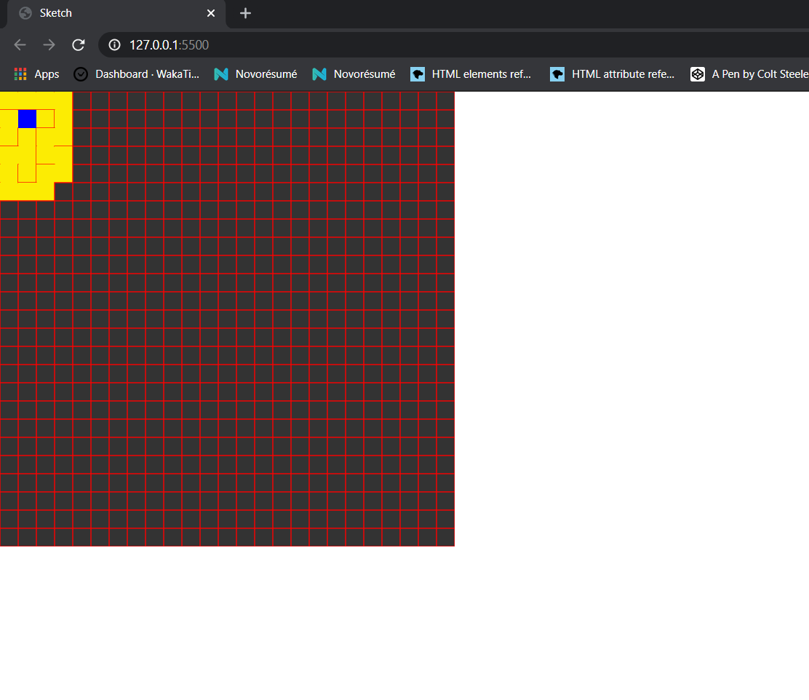
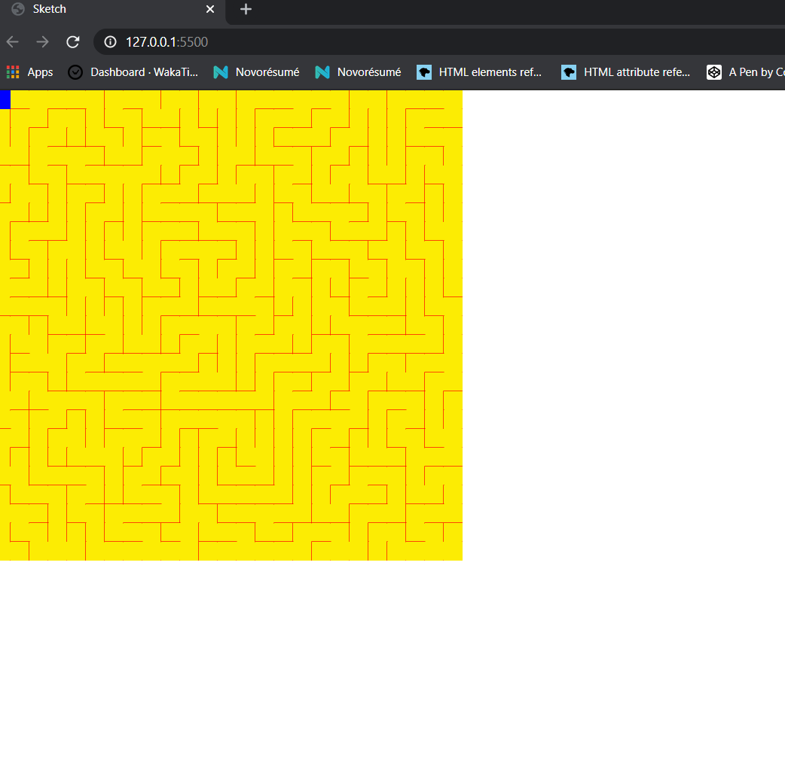

# Maze-Generator

This is a maze generator made using the depth-first and backtracking algorithms.
I made this using the p5.js library.
These are few of the snaps of the maze getting created.
You need to run this over a server so as to load it .
You can use an extension "live server" in vs code to run it. 

